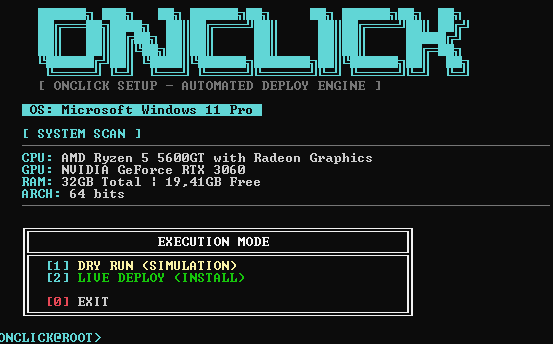
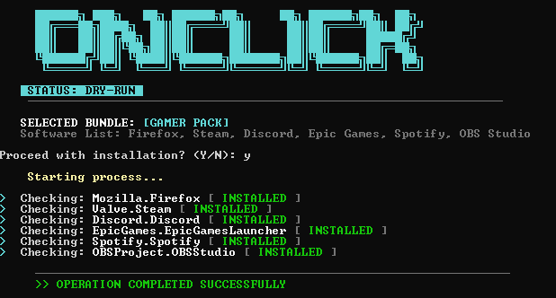

# 🚀 OnClick Setup – Automated Windows Installer

> 🇧🇷 Instalador automático para Windows usando WinGet, criado para facilitar a reinstalação de softwares após formatar ou resetar o sistema.  
> 🇺🇸 Automated Windows installer using WinGet, built to simplify software reinstallation after a system reset.

---

## 📌 Sobre / About

🇧🇷  
Sempre que eu precisava resetar ou formatar o Windows, eu perdia muito tempo baixando e instalando manualmente todos os programas que uso no dia a dia.  
Para resolver isso, criei o **OnClick Setup** — um instalador automático com menu interativo que utiliza o **Windows Package Manager (WinGet)**.  

Este projeto foi desenvolvido como **teste técnico** e também como **projeto de portfólio**, demonstrando automação, organização de fluxo e usabilidade em ambiente Windows.

🇺🇸  
Whenever I needed to reset or reformat Windows, I wasted a lot of time manually downloading and installing all the software I use daily.  
To solve this, I created **OnClick Setup** — an automated installer with an interactive menu that uses the **Windows Package Manager (WinGet)**.  

This project was developed as a **technical test** and a **portfolio project**, demonstrating automation, workflow organization, and usability on Windows.

---

## 📥 Download do EXE / EXE Download

🇧🇷  
Você pode baixar o executável `.exe` diretamente na aba **Releases** do repositório.

➡️ **Download:**  
https://github.com/x864dev/-OnClick-Setup-Automated-Windows-Installer/releases/tag/v1.0

🇺🇸  
You can download the `.exe` file directly from the **Releases** section of the repository.

➡️ **Download:**  
https://github.com/x864dev/-OnClick-Setup-Automated-Windows-Installer/releases/tag/v1.0

---

## 🛠️ Requisitos / Requirements

🇧🇷  
✔ Windows 10 ou Windows 11  
✔ WinGet instalado  
✔ Conexão com a internet  

🇺🇸  
✔ Windows 10 or Windows 11  
✔ WinGet installed  
✔ Internet connection  

---

## 🚀 Como usar / How to Use

🇧🇷  
1. Baixe o arquivo `OnClickSetup.exe`  
2. Execute o programa **como Administrador**  
3. Escolha uma opção no menu interativo  
4. Aguarde a instalação automática dos softwares  

🇺🇸  
1. Download the `OnClickSetup.exe` file  
2. Run the program **as Administrator**  
3. Choose an option from the interactive menu  
4. Wait for the automatic software installation  

---

## 🧭 Funcionalidades / Features

🇧🇷  
- Menu interativo em terminal  
- Instalação automática via WinGet  
- Catálogo de softwares  
- Instalação por pacotes (bundles)  
- Atualização de softwares e sistema  
- Processo de instalação com feedback em tempo real  

🇺🇸  
- Interactive terminal menu  
- Automatic installation using WinGet  
- Software catalog  
- Bundle-based installation  
- System and software updates  
- Real-time installation feedback  

---

## 🖼️ Interface do OnClick Setup

🇧🇷  
Abaixo estão algumas telas do **OnClick Setup**, mostrando o menu, modos de execução e fluxo do instalador.

🇺🇸  
Below are some screenshots of **OnClick Setup**, showing the menu, execution modes, and installer flow.

### 🏠 Home

### ⚙️ Execution Mode

### 📦 Software Catalog

### 🧩 Bundle Select

### 🔄 Process

### 🔧 Update System

---

## 🧪 Tecnologias Utilizadas / Technologies Used

- Windows Batch / Script  
- WinGet (Windows Package Manager)  
- Windows Terminal / CMD  

---

## 🎯 Objetivo do Projeto / Project Goal

🇧🇷  
Demonstrar habilidades em automação, organização de fluxo, interação via terminal e criação de ferramentas práticas para o ambiente Windows.

🇺🇸  
To demonstrate skills in automation, workflow organization, terminal interaction, and building practical tools for the Windows environment.

---

## 📄 Licença / License

Este projeto é de uso livre para fins educacionais e de portfólio.  
This project is free to use for educational and portfolio purposes.

---

## 👤 Autor / Author

**André Ananias (x864dev)**  
GitHub: https://github.com/x864dev
---
Linkdin https://www.linkedin.com/in/andrepczx/
